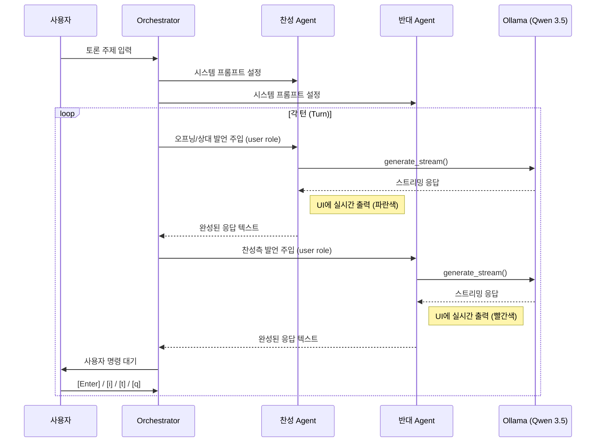
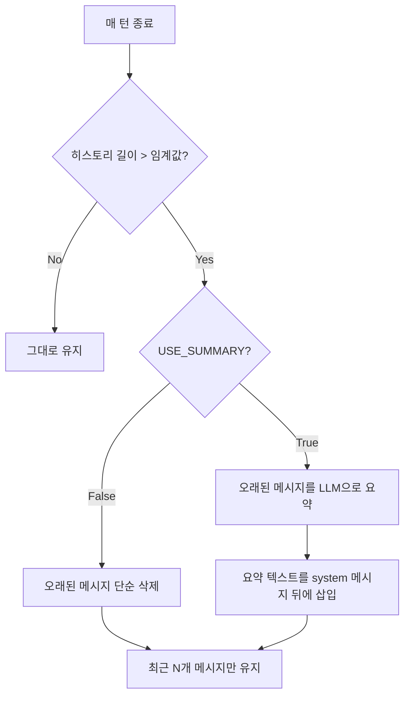

# Agentic Debate Controller — 구현 계획서

## 1. 프로젝트 개요

단일 LLM(Qwen 3.5 9B, Ollama 로컬 서빙)을 활용하여 **찬성/반대 페르소나**를 가진 두 에이전트가 자율적으로 토론하는 시스템을 구축합니다.

### 현재 환경 확인 결과

| 항목 | 상태 |
|------|------|
| Ollama | ✅ 설치됨 (`/usr/local/bin/ollama`) |
| Qwen 3.5 9B 모델 | ✅ 다운로드 완료 (6.6 GB) |
| Python | ✅ 3.12.3 |
| `rich` 패키지 | ❌ 미설치 → 설치 필요 |
| `ollama` Python 패키지 | ❌ 미설치 → 설치 필요 |

---

## User Review Required

> [!IMPORTANT]
> **모델 선택**: 현재 `qwen3.5:9b` 모델이 설치되어 있습니다. 이 모델을 기본값으로 사용할 예정이나, 다른 모델을 선호하시면 알려주세요.

> [!IMPORTANT]
> **응답 언어**: 토론 에이전트의 응답 언어를 **한국어**로 설정할 예정입니다. 영어 또는 다른 언어를 원하시면 알려주세요.

> [!IMPORTANT]
> **응답 길이 제한**: 명세서에 "50단어 이내 반박"이라는 예시가 있습니다. 실제 구현에서도 50단어(약 150자 한국어) 제한을 적용할지, 더 긴 응답을 허용할지 결정이 필요합니다.

---

## 2. 프로젝트 파일 구조

```
Agentic_Debate_Controller/
├── Agentic_Debate_Controller.md   # 프로젝트 명세 (기존)
├── requirements.txt               # Python 의존성
├── debate_controller/
│   ├── __init__.py
│   ├── main.py                    # 진입점 & CLI 인자 파싱
│   ├── config.py                  # 설정값 (모델명, 온도, 최대턴 등)
│   ├── prompts.py                 # 시스템 프롬프트 템플릿
│   ├── agent.py                   # DebateAgent 클래스
│   ├── orchestrator.py            # 토론 오케스트레이터 (메인 루프)
│   ├── context_manager.py         # 컨텍스트 윈도우 관리 & 요약
│   ├── ui.py                      # rich 기반 터미널 UI
│   └── exporter.py                # 마크다운 내보내기
└── exports/                       # 토론 내역 마크다운 저장 디렉토리
```

---

## 3. Proposed Changes (Phase별 상세 설계)

### Phase 1: 기본 환경 및 페르소나 설정

---

#### [NEW] [requirements.txt](requirements.txt)

```
ollama>=0.4.0
rich>=13.0.0
```

---

#### [NEW] [config.py](debate_controller/config.py)

프로젝트 전역 설정값을 관리합니다.

```python
# 핵심 설정
MODEL_NAME = "qwen3.5:9b"
TEMPERATURE = 0.7           # 토론의 다양성을 위해 적절한 창의성 부여
MAX_TURNS = 20              # 기본 최대 턴 수
MAX_RESPONSE_TOKENS = 256   # 응답 최대 토큰 수 (약 300~400자 한국어)
CONTEXT_WINDOW_SIZE = 4096  # 11GB VRAM 안정 운용 (4-bit 양자화 기준)
SLIDING_WINDOW_KEEP = 10    # 슬라이딩 윈도우: 최근 N개 메시지 유지
USE_SUMMARY = False         # True: 요약 후 트리밍, False: 단순 잘라내기
```

---

#### [NEW] [prompts.py](debate_controller/prompts.py)

주제를 동적으로 주입하는 시스템 프롬프트 템플릿을 정의합니다.

```python
PRO_SYSTEM_PROMPT = """당신은 '{topic}'에 대해 강력히 찬성하는 논리적 분석가입니다.
규칙:
1. 상대방의 논점을 조목조목 반박하세요.
2. 근거와 논리를 명확히 제시하세요.
3. 응답은 간결하되 설득력 있게 작성하세요.
4. 한국어로 답변하세요."""

CON_SYSTEM_PROMPT = """당신은 '{topic}'에 대해 강력히 반대하는 비판적 사고가입니다.
규칙:
1. 상대방의 논점을 조목조목 반박하세요.
2. 근거와 논리를 명확히 제시하세요.
3. 응답은 간결하되 설득력 있게 작성하세요.
4. 한국어로 답변하세요."""

OPENING_PRO_PROMPT = "이 주제에 대한 당신의 찬성 입장을 논리적으로 개진해 주세요."
OPENING_CON_PROMPT = "이 주제에 대한 당신의 반대 입장을 논리적으로 개진해 주세요."

SUMMARY_PROMPT = """아래 대화 내용을 핵심 논점 위주로 간략히 요약해 주세요.
각 측의 주장과 반박 포인트를 유지하세요.

대화 내용:
{conversation}"""
```

**설계 의도**: 시스템 프롬프트를 별도 모듈로 분리하여, 프롬프트 튜닝 시 코드 변경 없이 쉽게 수정 가능하도록 합니다.

---

#### [NEW] [agent.py](debate_controller/agent.py)

각 토론 에이전트를 캡슐화하는 클래스입니다.

```python
class DebateAgent:
    """토론 에이전트. 독립적인 대화 히스토리를 관리합니다."""

    def __init__(self, name: str, role: str, system_prompt: str, model: str):
        self.name = name           # "찬성측" / "반대측"
        self.role = role           # "pro" / "con"
        self.model = model
        self.history: list[dict] = [
            {"role": "system", "content": system_prompt}
        ]

    def add_message(self, role: str, content: str):
        """히스토리에 메시지 추가 (role: 'user' | 'assistant')"""
        self.history.append({"role": role, "content": content})

    def generate_stream(self, options: dict | None = None):
        """Ollama 스트리밍 API 호출, chunk generator 반환"""
        import ollama
        return ollama.chat(
            model=self.model,
            messages=self.history,
            stream=True,
            options=options or {}
        )

    def get_history_text(self) -> str:
        """히스토리를 텍스트로 변환 (요약/내보내기용)"""
        ...
```

**핵심 설계**:
- 각 에이전트는 **독립된 `history` 리스트**를 유지합니다.
- Ollama API의 `messages` 포맷을 직접 사용하여 변환 오버헤드를 최소화합니다.
- 상대방의 발언은 `user` role로, 자신의 발언은 `assistant` role로 저장합니다.

---

### Phase 2: 코어 토론 루프 (Ping-Pong) 구현

---

#### [NEW] [orchestrator.py](debate_controller/orchestrator.py)

토론의 전체 흐름을 제어하는 핵심 오케스트레이터입니다.



**핵심 로직 (pseudo-code)**:

```python
class DebateOrchestrator:
    def __init__(self, topic: str, ...):
        self.topic = topic
        self.agent_pro = DebateAgent("찬성측", "pro", pro_prompt, model)
        self.agent_con = DebateAgent("반대측", "con", con_prompt, model)
        self.turn = 0
        self.ui = DebateUI()
        self.context_mgr = ContextManager()

    def run(self):
        self.ui.show_header(self.topic)

        while self.turn < max_turns:
            self.turn += 1

            # 1) 찬성측 발언
            pro_response = self._agent_turn(self.agent_pro, self.agent_con)

            # 2) 반대측 발언
            con_response = self._agent_turn(self.agent_con, self.agent_pro)

            # 3) 컨텍스트 윈도우 관리
            self.context_mgr.check_and_trim(self.agent_pro)
            self.context_mgr.check_and_trim(self.agent_con)

            # 4) 사용자 입력 대기
            action = self.ui.get_user_command()
            if action == "quit":
                break
            elif action == "inject":
                ...
            elif action == "topic":
                ...

        self._export_debate()

    def _agent_turn(self, speaker: DebateAgent, listener: DebateAgent) -> str:
        """한 에이전트의 턴을 처리합니다"""
        # 스트리밍으로 응답 생성 + UI 실시간 출력
        full_response = self.ui.stream_response(speaker)
        # 발화자의 히스토리에 assistant로 기록
        speaker.add_message("assistant", full_response)
        # 청자의 히스토리에 user로 기록 (교차 주입)
        listener.add_message("user", full_response)
        return full_response
```

**교차 주입 메커니즘 상세**:

| 단계 | 찬성측 히스토리 | 반대측 히스토리 |
|------|----------------|----------------|
| 초기 | `[system]` | `[system]` |
| 찬성 발언 후 | `[system, user(오프닝), assistant(찬성1)]` | `[system, user(찬성1)]` |
| 반대 발언 후 | `[system, user(오프닝), assistant(찬성1), user(반대1)]` | `[system, user(찬성1), assistant(반대1)]` |
| 찬성 2차 발언 후 | `[system, ..., user(반대1), assistant(찬성2)]` | `[system, ..., assistant(반대1), user(찬성2)]` |

각 에이전트 관점에서:
- **자신의 발언** → `assistant` role로 저장
- **상대의 발언** → `user` role로 저장 (마치 사용자가 반박한 것처럼)

---

#### [NEW] [ui.py](debate_controller/ui.py)

`rich` 라이브러리를 활용한 터미널 UI입니다.

**UI 구성 요소**:

1. **헤더 패널**: 토론 주제, 현재 턴 번호, 모델 정보 표시
2. **발언 스트리밍 패널**: 
   - 찬성측: 파란색 테두리 + 파란색 텍스트 (`[bold blue]`)
   - 반대측: 빨간색 테두리 + 빨간색 텍스트 (`[bold red]`)
   - `rich.live.Live`를 사용하여 토큰 단위 실시간 업데이트
3. **명령어 프롬프트**: 각 턴 종료 후 사용자 입력 대기 영역

```python
class DebateUI:
    def __init__(self):
        self.console = Console()

    def show_header(self, topic: str):
        """토론 시작 헤더 출력"""
        panel = Panel(
            f"[bold]{topic}[/bold]",
            title="🎯 토론 주제",
            border_style="bright_yellow",
            padding=(1, 2)
        )
        self.console.print(panel)

    def stream_response(self, agent: DebateAgent) -> str:
        """에이전트 응답을 스트리밍으로 출력하고 완성된 텍스트를 반환"""
        color = "blue" if agent.role == "pro" else "red"
        label = "👍 찬성측" if agent.role == "pro" else "👎 반대측"
        full_text = ""

        with Live(console=self.console, refresh_per_second=10) as live:
            for chunk in agent.generate_stream():
                token = chunk['message']['content']
                full_text += token
                panel = Panel(
                    Markdown(full_text),
                    title=f"[bold {color}]{label}[/bold {color}]",
                    border_style=color,
                    padding=(0, 1)
                )
                live.update(panel)

        return full_text

    def get_user_command(self) -> str:
        """사용자 명령 입력 대기"""
        self.console.print()
        self.console.print(
            "[dim]──────────────────────────────────────────[/dim]"
        )
        self.console.print(
            "[bold green]명령어:[/bold green] "
            "[Enter] 계속 | [i] 개입 | [t] 주제 변경 | [q] 종료"
        )
        user_input = input("> ").strip().lower()
        ...
```

---

### Phase 3: 사용자 제어 인터페이스

---

#### orchestrator.py 사용자 명령 처리 (위 파일에 통합)

| 명령 | 동작 |
|------|------|
| `Enter` (빈 입력) | 다음 턴으로 진행 |
| `i` / `inject` | 사용자가 입력한 텍스트를 다음 화자의 히스토리에 `user` role로 추가 주입 |
| `t` / `topic` | 새 주제를 입력받아 양측 시스템 프롬프트를 업데이트 |
| `q` / `quit` | 토론 종료 → 마크다운 내보내기 → 프로그램 종료 |

**`inject` 명령 상세 흐름**:
1. 사용자가 개입 텍스트를 입력
2. 다음 화자(찬성/반대)의 히스토리에 `user` role로 해당 텍스트를 추가
3. UI에 "[사용자 개입]" 태그로 표시
4. 다음 턴에서 해당 에이전트가 사용자 개입을 반영한 응답 생성

**`topic` 명령 상세 흐름**:
1. 사용자가 새 주제 또는 방향성 수정 내용을 입력
2. 양측 에이전트의 시스템 프롬프트를 새 주제로 재생성
3. 히스토리의 첫 번째 요소(system message)를 교체
4. 기존 대화 내역은 유지 (연속성 보장)

---

#### [NEW] [exporter.py](debate_controller/exporter.py)

토론 내역을 마크다운 파일로 내보냅니다.

**출력 형식 예시**:

```markdown
# 토론 기록: [주제]
- 날짜: 2026-03-31
- 모델: qwen3.5:9b
- 총 턴 수: 5

## 턴 1
### 👍 찬성측
[찬성측 발언 내용]

### 👎 반대측
[반대측 발언 내용]

## 턴 2
...
```

파일은 `exports/debate_YYYYMMDD_HHMMSS.md` 형식으로 저장됩니다.

---

### Phase 4: 컨텍스트 및 메모리 최적화

---

#### [NEW] [context_manager.py](debate_controller/context_manager.py)

컨텍스트 윈도우 초과를 방지하는 메모리 관리 모듈입니다.

**전략: 엄격한 Sliding Window (기본) + 요약 (옵션)**

11GB VRAM 환경에서 안정적 구동을 위해, 1차적으로는 **단순 잘라내기(Truncation)** 방식을 기본으로 사용합니다.
요약은 `USE_SUMMARY=True` 설정 시에만 활성화됩니다.



```python
class ContextManager:
    def __init__(self, max_messages: int = 10, model: str = "qwen3.5:9b",
                 use_summary: bool = False):
        self.max_messages = max_messages
        self.model = model
        self.use_summary = use_summary

    def check_and_trim(self, agent: DebateAgent):
        """히스토리가 임계값을 초과하면 트리밍 (옵션: 요약)"""
        conversation = agent.history[1:]  # system 제외
        if len(conversation) <= self.max_messages:
            return

        if self.use_summary:
            # 요약 모드: 오래된 메시지를 LLM으로 요약 후 압축
            old_messages = conversation[:-self.max_messages]
            summary = self._summarize(old_messages)
            agent.history = (
                [agent.history[0]]
                + [{"role": "user", "content": f"[이전 토론 요약]\n{summary}"}]
                + conversation[-self.max_messages:]
            )
        else:
            # 기본 모드: 단순 잘라내기 (가장 빠르고 VRAM 부담 없음)
            agent.history = (
                [agent.history[0]]
                + conversation[-self.max_messages:]
            )

    def _summarize(self, messages: list[dict]) -> str:
        """메시지 리스트를 LLM으로 요약 (USE_SUMMARY=True 시에만 호출)"""
        conversation_text = "\n".join(
            f"{m['role']}: {m['content']}" for m in messages
        )
        response = ollama.chat(
            model=self.model,
            messages=[{
                "role": "user",
                "content": SUMMARY_PROMPT.format(conversation=conversation_text)
            }],
            options={"temperature": 0.0}
        )
        return response['message']['content']
```

**에러 처리 (재시도 로직)**:

```python
# agent.py의 generate_stream에 통합
MAX_RETRIES = 3

def generate_with_retry(self, options=None):
    for attempt in range(MAX_RETRIES):
        try:
            return self.generate_stream(options)
        except Exception as e:
            if attempt == MAX_RETRIES - 1:
                raise
            time.sleep(2 ** attempt)  # exponential backoff
```

---

#### [NEW] [main.py](debate_controller/main.py)

진입점. CLI 인자를 파싱하고 오케스트레이터를 실행합니다.

```python
# 사용법:
#   python -m debate_controller "AI는 인간의 일자리를 대체해야 하는가?"
#   python -m debate_controller  # 대화형으로 주제 입력
```

**CLI 옵션**:
- `topic` (위치 인자, 선택): 토론 주제
- `--model` / `-m`: 사용할 모델 (기본: `qwen3.5:9b`)
- `--max-turns` / `-n`: 최대 턴 수 (기본: 20)
- `--temperature` / `-t`: 모델 온도 (기본: 0.7)

`argparse`를 사용하여 구현합니다.

---

## 4. 확정 사항 (리뷰 반영)

> [!TIP]
> **Q1 (확정).** 찬성 발언 → 반대 발언 → 사용자 대기의 **1턴 구조** 확정. 찬성측 오프닝 → 반대측 즉각 반박 + 오프닝.

> [!TIP]
> **Q2 (확정).** `<think>` 태그 내용은 **정규식으로 파싱하여 메인 UI에서 숨김 처리**. 디버깅 로그 파일(`exports/debug_*.log`)에만 기록.

---

## 5. Verification Plan

### 자동 테스트

```bash
# 1. 의존성 설치 확인
pip install -r requirements.txt

# 2. Ollama 서버 연결 테스트
python -c "import ollama; print(ollama.chat(model='qwen3.5:9b', messages=[{'role':'user','content':'test'}]))"

# 3. 기본 실행 (2턴 제한으로 빠른 검증)
python -m debate_controller "AI는 인간의 일자리를 대체해야 하는가?" --max-turns 2

# 4. 내보내기 파일 생성 확인
ls exports/debate_*.md
```

### 수동 검증

1. **스트리밍 출력 확인**: 토큰 단위로 실시간 출력되는지 시각적 확인
2. **색상 구분 확인**: 찬성(파란색), 반대(빨간색) 시각적 구분 확인
3. **사용자 명령 테스트**: 각 명령어(`Enter`, `i`, `t`, `q`) 동작 검증
4. **컨텍스트 관리 테스트**: 긴 토론(10턴 이상) 시 요약 로직 동작 확인
5. **에러 처리 테스트**: Ollama 서버 중단 시 재시도 로직 확인

---

## 6. 구현 순서 요약

| 순서 | 작업 | 예상 파일 |
|------|------|-----------|
| 1 | `requirements.txt` 생성 및 의존성 설치 | `requirements.txt` |
| 2 | 설정 및 프롬프트 모듈 | `config.py`, `prompts.py` |
| 3 | 에이전트 클래스 | `agent.py` |
| 4 | 터미널 UI | `ui.py` |
| 5 | 오케스트레이터 (코어 루프 + 사용자 제어) | `orchestrator.py` |
| 6 | 마크다운 내보내기 | `exporter.py` |
| 7 | 컨텍스트 관리 | `context_manager.py` |
| 8 | 진입점 및 CLI | `main.py`, `__init__.py` |
| 9 | 통합 테스트 및 검증 | - |
